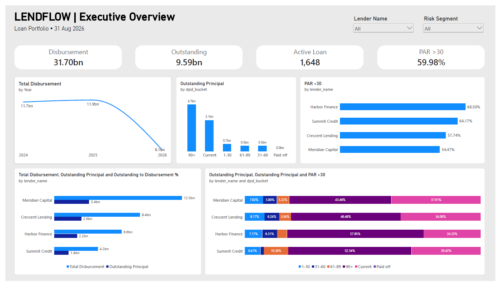
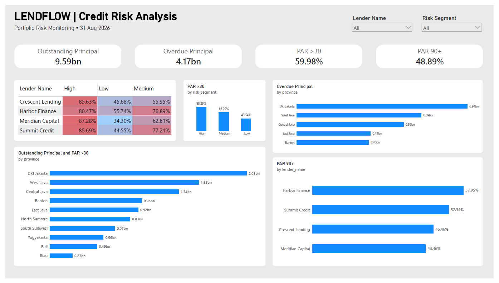

# Loan Portfolio Performance & Risk Analytics

**SQL | Power BI | Financial Analytics**

## Overview

I built this project to explore how a digital lending company can monitor its loan portfolio and identify potential credit risks.

Using a synthetic dataset of 2,000 loans, I analyzed disbursement trends, outstanding balances, and delinquency across different lenders and borrower segments.

I used SQL to explore and prepare the data, then built two Power BI dashboards to present the findings.

## Dataset & Tools

The project uses synthetic lending data covering loan disbursements, borrower profiles, installment schedules, repayments, and lending partners.

The dataset includes:
- 2,000 loans
- 1,500 borrowers
- 4 lending partners
- Installment and repayment transaction records

**Tools used:**
- **SQL (DuckDB):** Data exploration, joins, validation, and KPI calculations
- **Power BI & DAX:** Dashboard development and visualization
- **Google Colab:** Running SQL queries and preparing data
- **GitHub:** Project documentation

All data is fictional and does not contain real customer or company information.

## Analysis Process

I started by exploring the datasets and checking the relationships between loans, borrowers, lenders, installments, and repayments.

After validating the data, I used SQL to calculate several portfolio metrics:

- Total loan disbursement
- Outstanding principal
- Overdue principal
- Days Past Due (DPD)
- Portfolio at Risk (PAR >30 and PAR 90+)

For the delinquency analysis, I calculated DPD based on the oldest unpaid overdue installment and grouped loans into different delinquency buckets.

I then prepared a loan-level dataset for Power BI, using **August 31, 2026** as the reporting snapshot.

## Power BI Dashboards

I created two dashboards to explore the results.

### 1. Executive Overview

This dashboard provides an overview of the loan portfolio, including:

- Disbursement trends
- Outstanding principal
- Delinquency distribution
- Portfolio performance by lender

### 2. Credit Risk Analysis

This dashboard focuses on identifying risk concentrations through:

- PAR >30 by borrower risk segment
- PAR 90+ by lender
- Credit risk heatmap
- Outstanding and overdue principal by province

Both dashboards include filters for lending partners and borrower risk segments.

## Key Findings

Here are a few things I found interesting from the analysis.

**1. A large portion of the portfolio is delinquent.**

Total outstanding principal reached approximately **IDR 9.59 billion**, with PAR >30 at **59.98%** and PAR 90+ at **48.89%**.

This means a significant portion of the remaining principal belongs to loans that are already overdue.

**2. Harbor Finance has the highest delinquency rate among lenders.**

Harbor Finance recorded PAR >30 of **68.50%** and PAR 90+ of **57.95%**, the highest among the four lenders.

This would be worth investigating further to understand whether the difference is related to borrower profiles, loan characteristics, or repayment patterns.

**3. Delinquency varies across borrower risk segments.**

The High Risk segment recorded PAR >30 of **85.25%**, compared with **66.29%** for Medium Risk and **43.54%** for Low Risk.

The results show a clear difference in repayment performance across the simulated risk segments.

**4. DKI Jakarta has the largest outstanding exposure.**

DKI Jakarta contributed approximately **IDR 2.05 billion** in outstanding principal and **IDR 0.94 billion** in overdue principal.

However, a higher outstanding balance does not necessarily mean a higher delinquency rate, so both metrics need to be considered.

## Recommendations

Based on these findings, I would recommend:

- Monitoring loans that are moving into higher DPD buckets, especially 30+ and 90+.
- Looking deeper into Harbor Finance's portfolio to understand its higher delinquency rates.
- Comparing repayment performance across risk segments and loan vintages.
- Tracking both outstanding amounts and delinquency rates when evaluating geographic risk.

These recommendations are based on simulated data and would need further investigation before being applied to a real lending portfolio.

## Limitations

This project uses synthetic data, so the findings do not represent actual lending performance.

The analysis is also based on a single reporting snapshot. Further analysis of historical loan vintages and repayment behavior would help provide a more complete picture of portfolio risk.

## About Me

**Tetty Vera Simbolon**

Business Intelligence Analyst | Data Analyst

I have experience working with SQL, financial reporting, data reconciliation, and business intelligence dashboards, particularly in the fintech industry.

I'm currently exploring opportunities in Data Analytics and Business Intelligence, including international remote roles.
